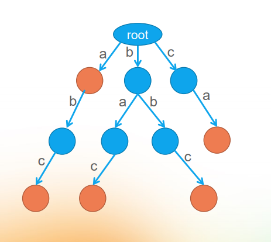
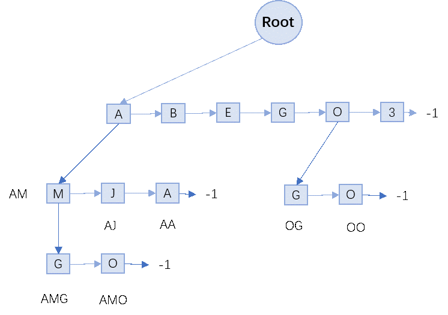
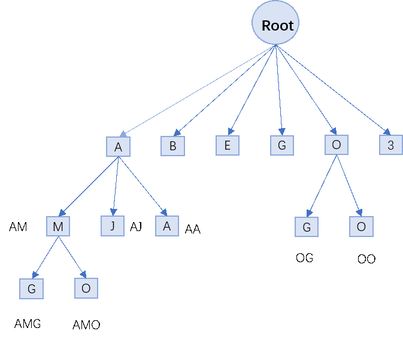

# Trie-Tree-By-T-SQL
* 功能：使用T-SQL语言实现字典树的插入与查询操作
* 实现细节：
  * 字典树插入：通过递归实现
  * 字典树查找：通过迭代实现
  * 数据库表初始化：将表恢复成只有一个根节点时的样子

### 设计原理描述：

* 字典树顾名思义是一个关于字典的树。在这颗树上，每个单词就是从根节点出发一直到某一个目标节点的路径，路径中每条边的字母连起来就是一个单词，如图：

* 本次在数据库表中保存字典树，所以对该数据结构进行如下改动：

1. 对于树的叶子节点，原设计是在叶子节点处设置一个数组或者链表通过遍历数组（链表）寻找下一个节点的位置。对于本实验设计，将数组的每个元素或者链表的每个节点都独立成一个数据库元组，通过查找元组来实现树的遍历。即树的每一个叶子节点采用链表的形式组织，上一个节点负责指向这个链表的头部，下个节点由遍历这一个表示叶子节点的链表来查找。

2. 每一个叶子节点的链表节点包括两个指针，一个指向链表的下一个节点，另一个指向下一个叶子节点（即指向下一个叶子节点对应链表的头结点），

3. 每一个节点存在一个Count字段，表示从根节点到该节点组成字符串的计数。

4. 根节点固定限制在数据库表中的第一行，即每次插入与查找都从第一行开始。

* 本代码中数据结构组织形式设计如下图，其中每一个方形代表一个链表节点（等价于一个元组），箭头代表指针指向某个节点：

  

 

* 本实验所重构的字典树其对应等价的一般形式字典树如下图

 

### 设计数据库关系模型

  如表是保存的Trie Tree信息的数据库，其中每一个元组被抽象成数据结构中的一个节点。

| 字段名     | 类型    | 限制       | 备注                                   |
| ---------- | ------- | ---------- | -------------------------------------- |
| id         | int     | not null   | 主键，自增                             |
| Element    | char(1) | allow null | 保存当前节点的字符                     |
| Next_Ptr   | int     | allow null | 保存下一个叶子头结点的位置             |
| Next_Chain | int     | allow null | 保存下一个叶子节点链表的下一个链的位置 |
| Count      | int     | allow null | 满足当前叶子节点字符串的计数           |

### 当前代码存在的问题

1. SQL SERVER存在递归层数限制，所以插入操作采用递归将会受到一定的限制。

2. 对于插入操作需要修改表，当程序并发调用的时不能保证线程安全，即可能会导致数据表混乱。